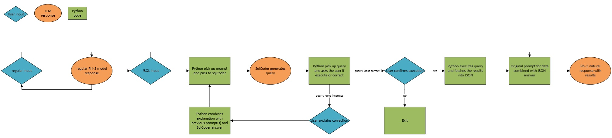

# AI agent for WMS application data analysis

## Design

The agent is capable of having a regular discussion as well as expecting plain questions on the database content. In case the question is data related, the prompt is redirected from a general purpose Phi-3 LLM model to SQLCoder model that generates the query. After approval the query is executed and the results are prompted back to Phi-3 to explain them to the user.

Phi-3 is expected to be replaced with a stronger model for proper data analysis in later phase.

---

## Purpose

The main purpose is to make a quick reply on the WMS database related questions in plain language.
The database of the WMS application has all the data needed for the daily site management. Simple, or more complex questions can be asked, like:

"How many orders have the delivery date scheduled for this week?"
"What is the relation between the B2B and B2C orders that we need to ship today?"
"Provide list of items where net weight is higher than gross weight"

Having a tool where questions can be asked in a plain language may replace the use of complex reporting tools where the datasets are predefined. This should support in taking the operational decisions.